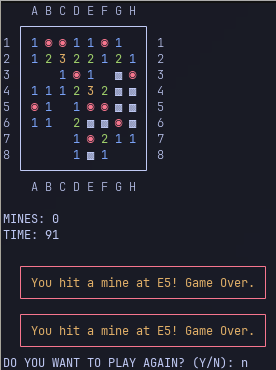

# TermSweeper

TermSweeper is a text-based implementation of the classic Minesweeper game that you can play in your terminal. It offers a simple and interactive experience with colorful text-based UI elements, making it easy to play directly from the command line.

## Disclaimers

_Created with the assistance of ChatGPT by OpenAI._

## Features

- **Classic Minesweeper Gameplay:** The game is played on an 8x8 grid with 10 mines randomly placed on the board.
- **Colorful Interface:** Uses ANSI color codes for a vibrant display, highlighting important aspects like flags, numbers, and mines.
- **Interactive Commands:** Players can open cells, flag/unflag suspected mines, and reveal surrounding cells using simple keyboard commands.
- **Victory and Game Over Detection:** The game automatically detects victory when all non-mine cells are revealed and all mines are correctly flagged. If a mine is revealed, the game ends with a "Game Over" message.
- **Instructions Display:** Players can toggle help instructions at any time by pressing `H`.

## Game Instructions

### Objective

The objective of the game is to clear the board by revealing all non-mine cells while correctly flagging all mines.

### How to Play

1. **Open a Cell:** Enter a coordinate (e.g., `A5`) to reveal a cell. If the cell contains a mine, the game will end.
2. **Flag/Unflag a Mine:** Use `F` as a prefix (e.g., `FA5`) to mark or unmark a cell as a suspected mine.
3. **Open Surrounding Cells:** Use `Z` as a prefix (e.g., `ZA5`) to reveal all adjacent cells around a coordinate, if the selected cell is empty.
4. **Show/Hide Instructions:** Press `H` to toggle the display of help instructions.
5. **Exit the Game:** Enter `Q` to quit the game.

### Game Mechanics

- **Numbers:** When you open a cell, if it is not a mine, it will show a number indicating how many mines are adjacent to that cell.
- **Flags:** Mark suspected mines with flags using the `F` prefix. You can toggle flags on and off.
- **Victory:** You win the game by revealing all non-mine cells and flagging all mines correctly.
- **Game Over:** The game ends when a mine is revealed.

## Setup and Installation

### Prerequisites

- A Unix-based terminal or a Windows command prompt that supports ANSI color codes.
- Python 3.x installed on your system.

### Installation

1. **Clone the Repository:**

   ```bash
   git clone https://github.com/lpanebr/term-sweeper.git
   cd termsweeper
   ```

2. **Run the Game:**
   ```bash
   python main.py
   ```

## Code Structure

- **main.py:** Contains the complete implementation of the TermSweeper game. The main logic includes functions for initializing the board, handling player input, and rendering the game state in the terminal.

- **Functions:**
  - `initialize_board()`: Sets up the game board with mines and visibility matrix.
  - `clear_screen()`: Clears the console for a fresh display.
  - `print_board()`: Renders the current state of the board with colors and UI elements.
  - `count_surrounding_mines()`: Counts the mines surrounding a given cell.
  - `reveal_adjacent()`: Reveals adjacent cells if the selected cell is empty.
  - `auto_reveal()`: Automatically reveals surrounding cells for empty cells.
  - `toggle_flag()`: Toggles the flag for marking/unmarking suspected mines.
  - `check_victory()`: Checks if all non-mine cells are revealed and all mines are flagged.
  - `print_boxed_text()`: Displays boxed text messages for instructions, warnings, etc.
  - `play_game()`: Main loop for running the game.

## Customization

- **Board Size:** You can modify the constants `N` (board size) and `B` (number of mines) to create different board configurations.
- **Colors:** Adjust the `COLORS` dictionary to customize the color scheme for various elements of the game.

## Example Gameplay



## Troubleshooting

- Ensure your terminal supports ANSI color codes for the best visual experience.
- If you encounter any issues with the game logic or display, make sure Python 3.x is installed and properly configured on your system.

## Contributing

Contributions are welcome! Feel free to submit issues or pull requests to improve the game, fix bugs, or add new features.

## License

This project is licensed under the MIT License. See the [LICENSE](LICENSE) file for details.

## Contact

For questions or feedback, please contact [yourname@example.com](mailto:yourname@example.com).
